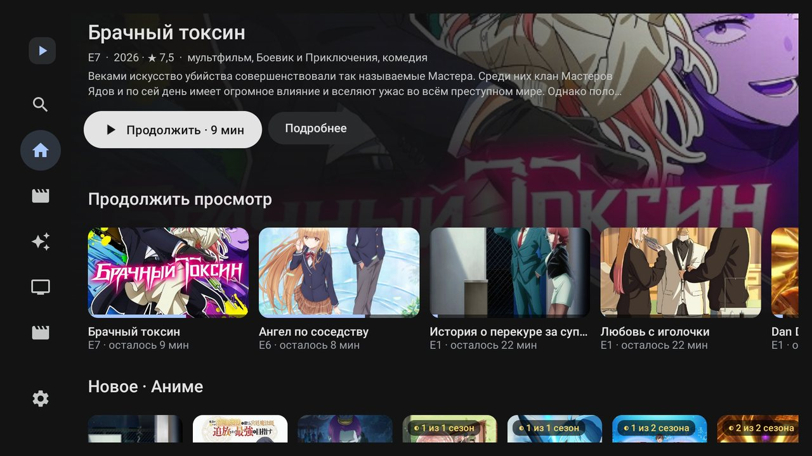
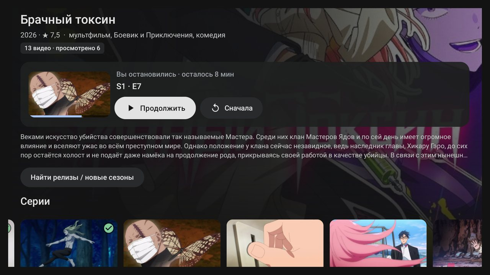
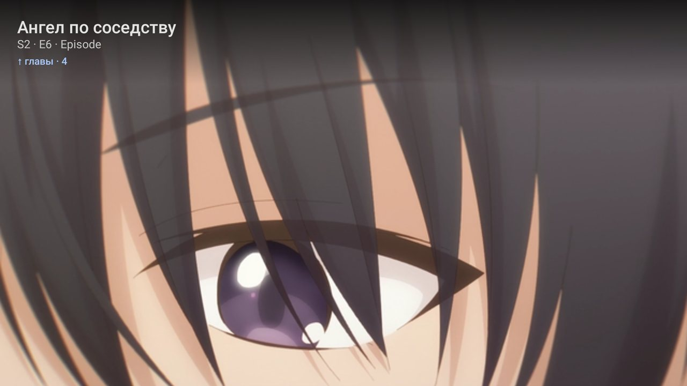
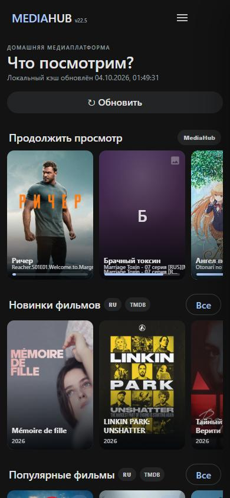
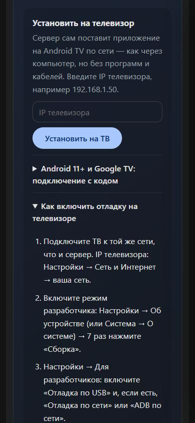
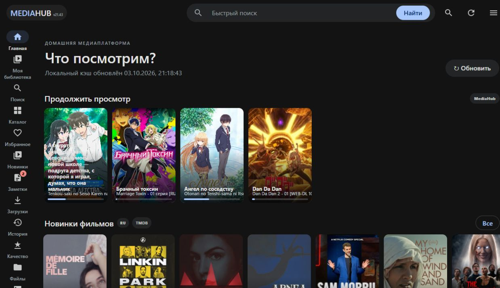
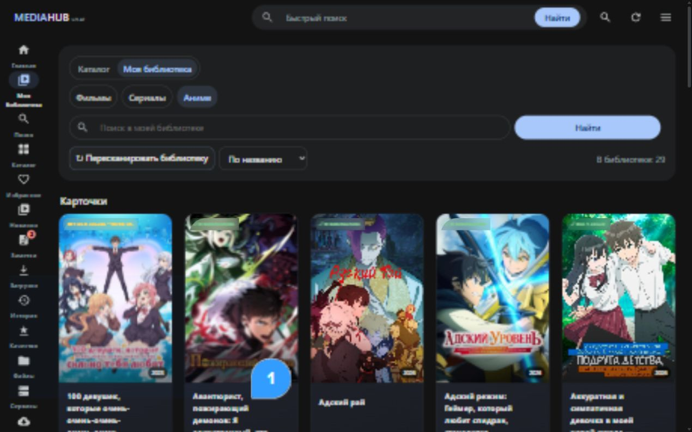
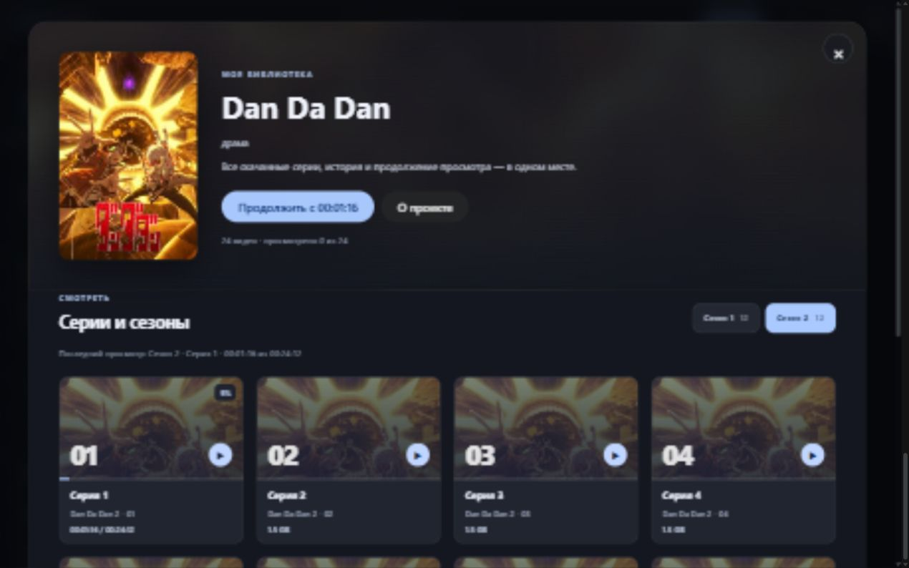
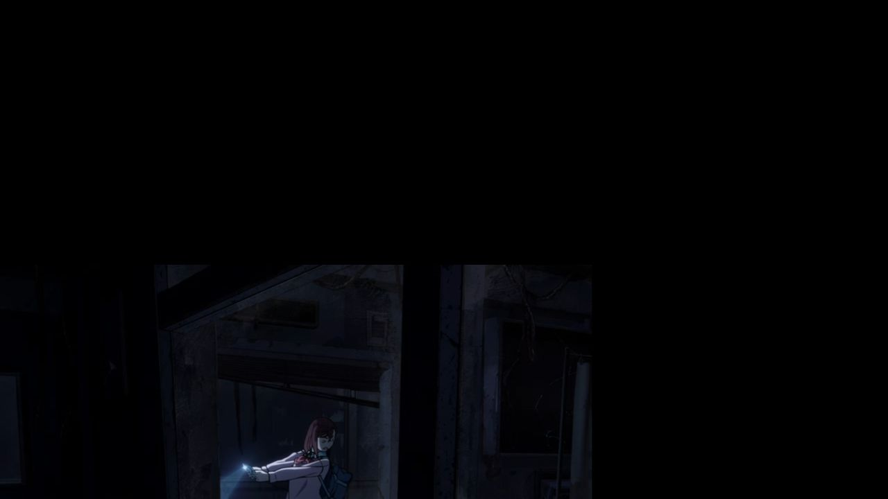
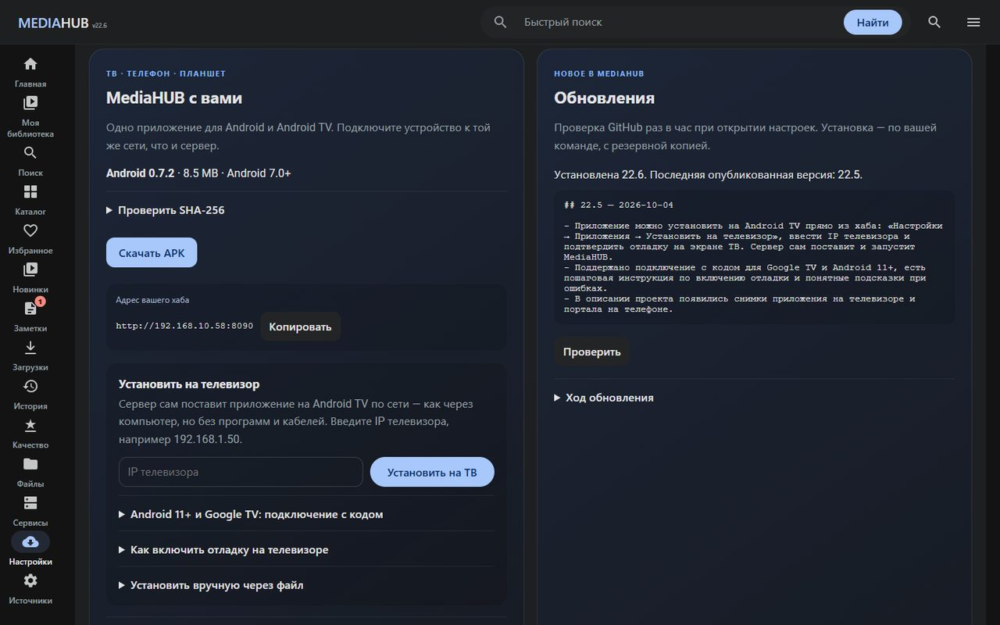

<p align="center"></p>

<p align="center"><a href="https://github.com/viendhyra/MediaHUB/actions/workflows/check.yml"></a></p>

<p align="center"><b>Скачивайте, собирайте и смотрите свою медиатеку.</b><br>Один портал для фильмов, сериалов, аниме, загрузок и домашних устройств.</p>

<p align="center"><a href="#быстрый-старт">Установить</a> · <a href="docs/INSTALL_RU.md">Инструкция</a> · <a href="docs/APPS_RU.md">ТВ и телефон</a> · <a href="docs/UPDATES_RU.md">Обновления</a> · <a href="CHANGELOG.md">Что нового</a></p>

## Что умеет MediaHUB

- Библиотека с постерами, сезонами, сериями и настоящими кадрами из видео.
- Веб-плеер: продолжение просмотра, качество, звуковые дорожки, субтитры и полный экран.
- Android-приложение 0.7.1 для телефона, планшета и Android TV: APK скачивается прямо из хаба, а на телевизор ставится из настроек по сети. Телефон может управлять просмотром на ТВ.
- Загрузки через qBittorrent, импорт torrent/magnet и страниц с релизами.
- Каталог, избранное, заметки и слежение за новыми сериями.
- Установка Debian VM в Proxmox с автоматическим подключением медиасервисов.
- Проверка новых версий GitHub, новости обновления, резервная копия и установка из портала.

Jellyfin в новый комплект не входит: просмотр работает через MediaHUB. Сервер работает в домашней сети; фронтенд не требует внешних CDN. Интернет нужен для установки, обновлений, внешних каталогов и источников.

## Быстрый старт

Нужен **Proxmox VE 8/9 на x86-64**, доступ root по SSH или через Shell, интернет и свободное хранилище. По умолчанию: **4 ядра, 4 GB RAM, 24 GB для Debian и 100 GB для медиатеки**. Для перекодирования тяжёлых HEVC-файлов нужен более быстрый CPU; аппаратное ускорение автоматически не настраивается.

**Из Windows:** [скачайте ZIP проекта](https://github.com/viendhyra/MediaHUB/archive/refs/heads/main.zip), распакуйте и запустите `INSTALL_PROXMOX.bat`. Введите IP Proxmox без `https://` и `:8006`, подтвердите SSH-ключ и введите пароль root.

**Из Shell Proxmox:**

```bash
curl -fL https://raw.githubusercontent.com/viendhyra/MediaHUB/main/scripts/proxmox-install.sh -o /root/mediahub-install.sh && bash /root/mediahub-install.sh
```

Мастер предложит ID VM, хранилище системы, хранилище медиатеки, объём дисков, RAM, CPU и сеть. Подтвердите сводку словом `CREATE`. Будут созданы **два новых виртуальных диска**; физические диски Proxmox не форматируются. Если `local` ещё не поддерживает snippets, мастер добавит этот тип содержимого для cloud-init, сохранив остальные типы.

Debian 13 скачивается из официального cloud-репозитория и проверяется по SHA-512. Cloud-init устанавливает MediaHUB, FFmpeg, qBittorrent, Prowlarr, Radarr, Sonarr и фоновые службы, создаёт структуру медиатеки и связывает сервисы. Установка использует зафиксированный коммит GitHub.

В конце откройте **`http://IP_НОВОЙ_VM:8090`**. Адрес VM будет в выводе гостевого агента Proxmox. Дайте установке до 30 минут; если она прервётся, созданная VM сохранится для диагностики.

### После первого запуска

1. Откройте **Настройки → Приложения**: скачайте APK на телефон или введите IP телевизора и нажмите **Установить на ТВ** ([как включить отладку](docs/APPS_RU.md)).
2. Для внешнего каталога сохраните собственный ключ TMDB в **Настройки → Подключения**. Он необязателен для просмотра своих файлов.
3. Если нужен поиск по индексерам, добавьте выбранные источники в Prowlarr на `http://IP_VM:9696`. Аккаунты закрытых трекеров выбирает пользователь. Связи Prowlarr ↔ Radarr/Sonarr и qBittorrent уже настроены.
4. Загрузите torrent/magnet или положите своё видео в `/mnt/media/movies`, `/mnt/media/tv` или `/mnt/media/anime` и обновите библиотеку.

У портала нет встроенного пароля. Используйте домашнюю сеть или собственный защищённый VPN; порт 8090 напрямую в интернет не открывайте.

## Как это выглядит

### На телевизоре

Приложение для Android TV: продолжение просмотра на главной, страница тайтла с сериями и плеер с главами. Управление стрелками пульта.



<details><summary>Тайтл и плеер на ТВ</summary>




</details>

### На телефоне

Портал открывается в браузере телефона без установки: главная с продолжением просмотра и настройки, откуда приложение ставится на телевизор по IP.

<p align="center"> &nbsp; </p>

### В браузере

**Главная и библиотека** — реальные снимки интерфейса 21.x; новый выпуск сохраняет эти экраны.



<details><summary>Библиотека, серии и просмотр</summary>





</details>

**Новые настройки** — снимок локального предпросмотра: установленная 22.0 обнаружила опубликованную 22.1. Приложение, инструкции и обновления доступны сразу; обслуживание раскрывается отдельно.



## Обновление сервера

В портале: **Настройки → Обновления → Проверить → Установить обновление**. Перед установкой доступны новости версии. Портал перезапустится, просмотр временно прервётся.

В Debian:

```bash
sudo mediahub-update
```

Для старой установки 21.x сначала выполните [подключение к GitHub-обновлениям](docs/UPDATES_RU.md). Из Windows доступен `UPDATE_MEDIAHUB.bat IP_DEBIAN`; он требует настроенного SSH-доступа к Debian. В новой VM ключ администратора хранится на Proxmox; удобнее обновлять через портал.

Код заменяется отдельно от `/etc/mediahub.env`, `/var/lib/mediahub` и `/mnt/media`. Перед заменой создаются копии кода, настроек и базы в `/var/backups/mediahub/`. Если новая версия не запускается, установщик возвращает прежний код и базу. Резервные копии автоматически не удаляются.

## Публикация своих доработок

Работайте в клоне репозитория, изменяйте `VERSION.txt` и добавляйте новости в начало `CHANGELOG.md`. Запустите `PUBLISH_GITHUB.bat`: скрипт проверит удалённую ветку, покажет состав изменений, создаст коммит и отправит его в `main`. Нужны Git for Windows и права записи в репозиторий. Архив ZIP не содержит `.git` и для публикации не подходит.

```powershell
git clone https://github.com/viendhyra/MediaHUB.git
cd MediaHUB
.\PUBLISH_GITHUB.bat "Описание обновления"
```

## Документация и проверки

| Документ | Содержание |
|---|---|
| [Установка](docs/INSTALL_RU.md) | Proxmox, Debian, SSH и диагностика |
| [Приложения](docs/APPS_RU.md) | Android TV, телефоны, планшеты и совместимость |
| [Обновления](docs/UPDATES_RU.md) | Переход с 21.x, резервные копии и восстановление |
| [Устройство системы](docs/WIKI_RU.md) | Файлы, порты, данные и API |
| [Хранилище](docs/STORAGE_WIZARD_RU.md) | Дополнительные диски и MediaPool |
| [План и проверка выпуска](docs/RELEASE_PLAN_RU.md) | Что сделано и границы проверки |

GitHub Actions проверяет Python, встроенный JavaScript, целостность APK, тесты, Bash и синтаксис PowerShell. Сценарий создания новой VM требует отдельного прогона на настоящем Proxmox: успешная проверка кода не заменяет проверку виртуализации и доступности внешних пакетов.
