# MediaHUB в картинках: что умеет портал

Пошаговая инструкция по основным возможностям. Все снимки сделаны на работающем сервере MediaHUB 22.6.
Адреса сторонних сайтов на снимках заменены условными.

**Содержание**

1. [Главная](#1-главная)
2. [Каталог и подбор по настроению](#2-каталог-и-подбор-по-настроению)
3. [Карточка тайтла и релизы](#3-карточка-тайтла-и-релизы)
4. [Загрузки: страница, .torrent, magnet](#4-загрузки-страница-torrent-magnet)
5. [Моя библиотека и просмотр](#5-моя-библиотека-и-просмотр)
6. [Редактирование карточек](#6-редактирование-карточек)
7. [Заметки и слежение за страницами](#7-заметки-и-слежение-за-страницами)
8. [Избранное и отслеживаемые](#8-избранное-и-отслеживаемые)
9. [Сервисы и стабильность](#9-сервисы-и-стабильность)
10. [Настройки: приложения, ТВ и обновления](#10-настройки-приложения-тв-и-обновления)
11. [Телевизор и телефон](#11-телевизор-и-телефон)

---

## 1. Главная

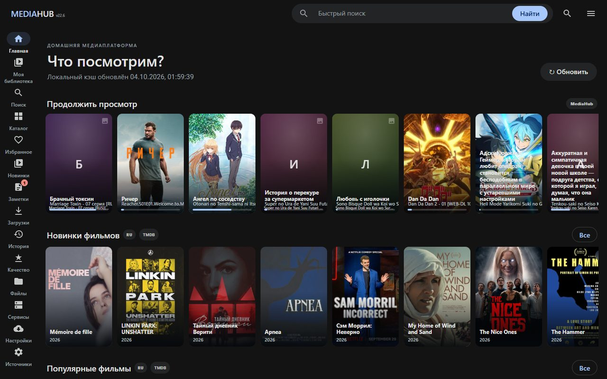

- **Продолжить просмотр** — всё, что вы начали смотреть в браузере, на телефоне или ТВ, с полосой прогресса. Нажмите карточку, и просмотр продолжится с той же секунды.
- Ниже — полки новинок и популярного по фильмам, сериалам и аниме. Пометки `RU` и `TMDB` показывают, откуда взята подборка.
- **Обновить** перечитывает подборки. Обычно это не нужно: кэш обновляется сам в фоне.

## 2. Каталог и подбор по настроению

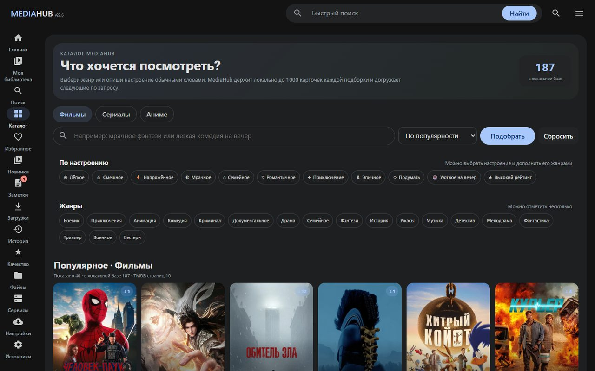

1. Выберите раздел: **Фильмы**, **Сериалы** или **Аниме**.
2. Опишите, что хочется, обычными словами («мрачное фэнтези», «лёгкая комедия на вечер») или нажмите настроение и жанры.
3. **Подобрать** покажет подходящие карточки. MediaHUB держит до 1000 карточек каждой подборки на сервере, поэтому листается быстро.

## 3. Карточка тайтла и релизы

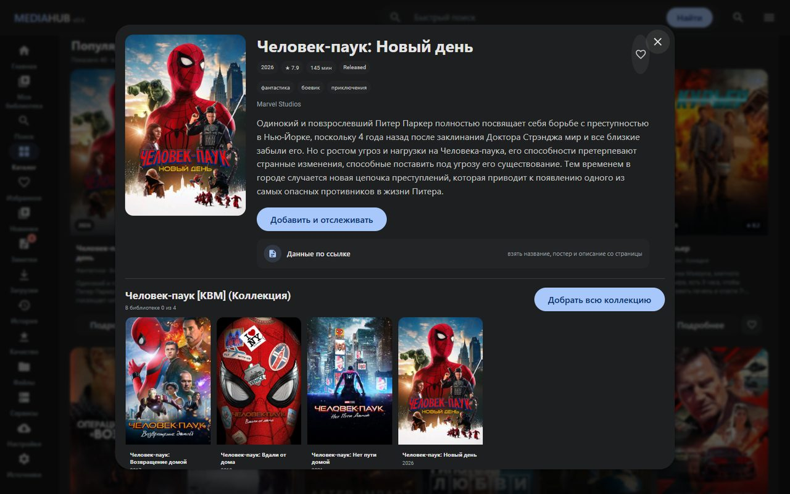

Карточка открывается мгновенно, описание и детали подгружаются следом.

- **Добавить и отслеживать** — передаёт тайтл в Radarr или Sonarr. Пока файлов нет, на карточке стоит «⏳ Отслеживается · файлов нет»; в библиотеку тайтл попадает, когда появятся файлы.
- **Коллекция** — все части франшизы; **Добрать всю коллекцию** добавит недостающие.
- **Данные по ссылке** — взять название, постер и описание со страницы любого сайта.
- ♥ — добавить в избранное.

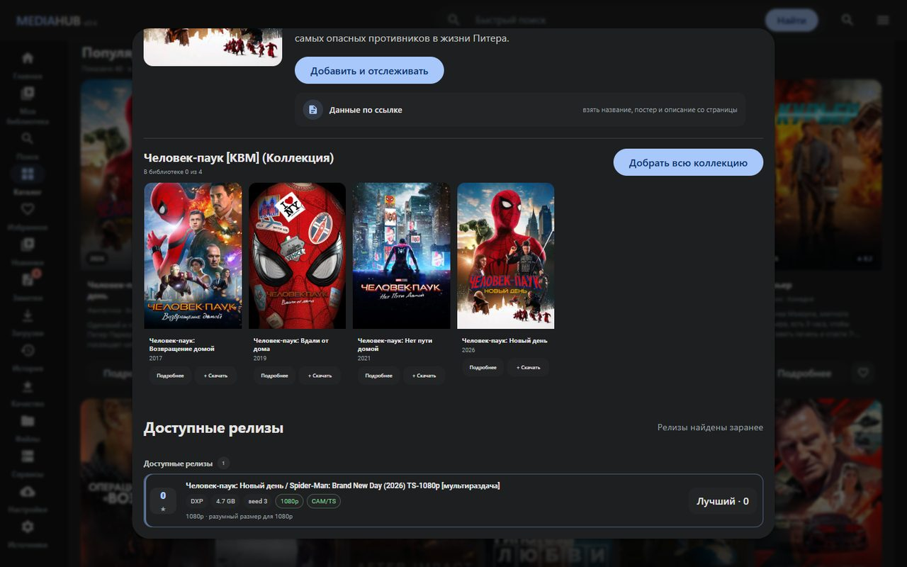

**Доступные релизы** ищутся в фоне по вашим источникам в Prowlarr. У каждого варианта видно источник, размер, число сидов, качество и пометки вроде `CAM/TS`. MediaHUB сверяет название и год, поэтому чужой фильм с похожим названием в списке не окажется. Если ничего не совпало, покажет ближайшие варианты с пометкой «Другое кино?». Нажмите релиз, чтобы отправить его в загрузку.

## 4. Загрузки: страница, .torrent, magnet

На странице **Загрузки** раздачу можно добавить тремя способами. Во всех случаях после скачивания MediaHUB сам перенесёт файлы в нужную папку медиатеки.

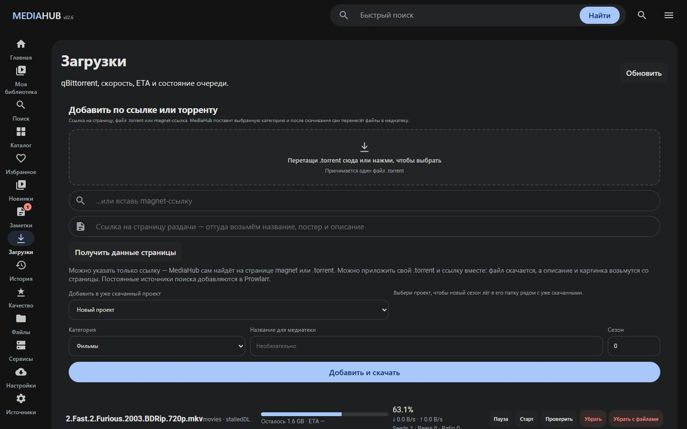

### 4.1. Просто ссылка на страницу раздачи

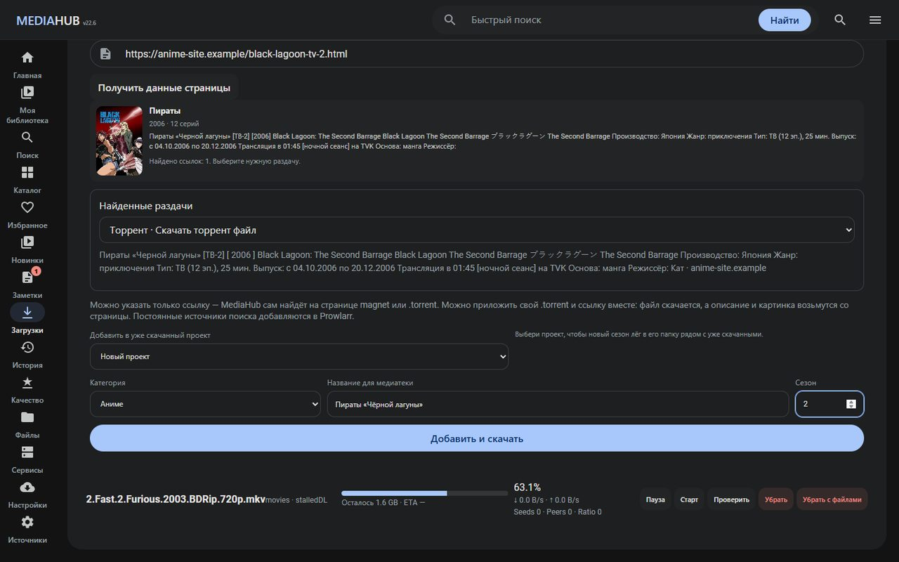

1. Скопируйте адрес страницы с раздачей на любом сайте и вставьте в поле **«Ссылка на страницу раздачи»**.
2. Нажмите **Получить данные страницы**. MediaHUB откроет страницу сам и найдёт:
   - название, год, число серий, постер и описание — из разметки страницы, полей «Название», «Год выхода», «О фильме»;
   - все ссылки на `.torrent` и magnet — в ссылках, кнопках и даже во встроенных скриптах.
3. В блоке **Найденные раздачи** выберите нужный вариант. Если раздача одна, она уже выбрана; случайная первая ссылка не скачивается.
4. Проверьте **Категорию** (фильм, сериал, аниме) и **Название для медиатеки**. Номер сезона подставляется со страницы.
5. Нажмите **Добавить и скачать**.

Если сайт требует входа или CAPTCHA, MediaHUB скажет об этом прямо. В таком случае скачайте `.torrent` в браузере и приложите его вместе со ссылкой: файл скачается, а описание и картинка возьмутся со страницы.

### 4.2. Свой файл .torrent или magnet

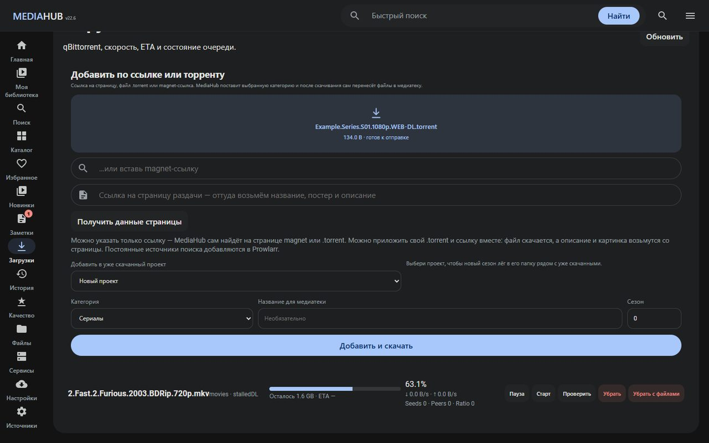

- Перетащите `.torrent` в пунктирную область или нажмите на неё и выберите файл. Можно вставить magnet-ссылку в поле ниже.
- Укажите категорию и, при желании, название и сезон. Фильмы, сериалы и аниме после скачивания раскладываются по медиатеке автоматически; категория «Вручную» оставляет файлы в папке загрузок.

### 4.3. Новый сезон к уже скачанному

В списке **Добавить в уже скачанный проект** выберите сериал, и новый сезон ляжет в его папку рядом с прежними. Сезон берётся из поля **Сезон**.

### 4.4. Очередь загрузок

Под формой видна очередь qBittorrent: прогресс, оставшийся объём, скорость, сиды и пиры. Кнопки:
**Пауза** и **Старт**, **Проверить** (перепроверка данных), **Убрать** (только из очереди) и **Убрать с файлами**.

## 5. Моя библиотека и просмотр

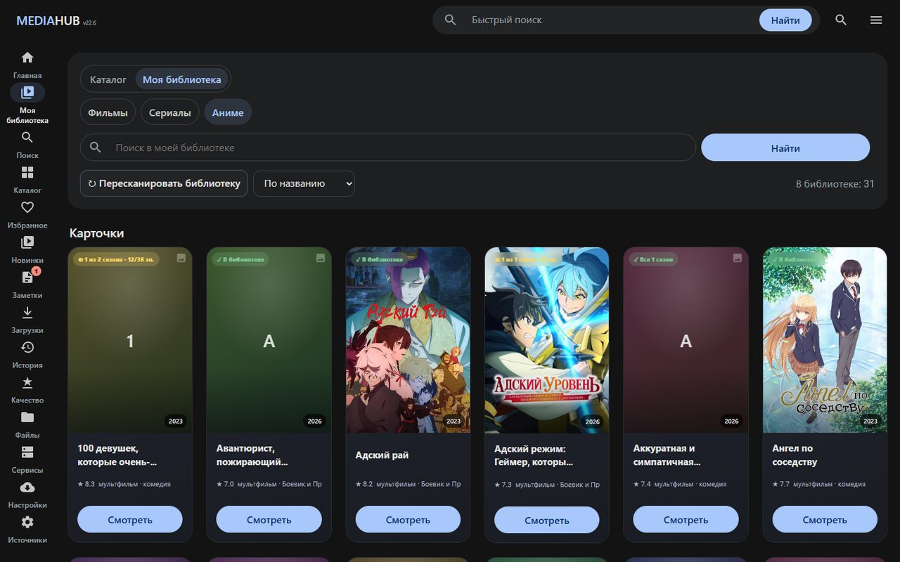

- Вкладки **Фильмы / Сериалы / Аниме**, поиск по библиотеке и сортировка.
- Пометки на постерах: «✓ В библиотеке», «◐ 1 из 2 сезонов · 12/36 эп.» — сколько уже скачано.
- **Пересканировать библиотеку** находит файлы, которые вы положили на диск вручную.

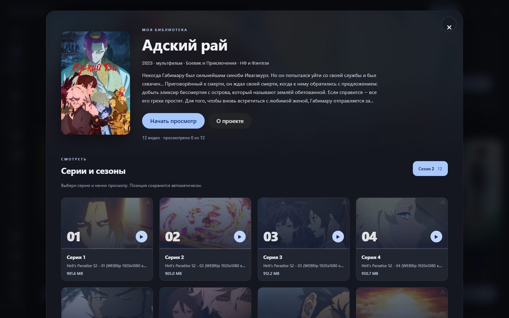

Нажмите **Смотреть** или карточку: откроются сезоны и серии с настоящими кадрами из видео и прогрессом. **Начать просмотр** продолжит с последней серии и места.

Встроенный плеер: качество, звуковые дорожки, субтитры (в том числе внешние SRT/VTT), главы и пропуск заставки, полный экран. Тяжёлые форматы перекодируются в 480p или 720p. Серия считается просмотренной, когда до конца осталось не больше трёх минут и просмотрено не меньше 85%: титры можно досмотреть, а следующая серия уже предложена.

## 6. Редактирование карточек

Нажмите **О проекте** в окне просмотра. Под описанием — управление проектом:

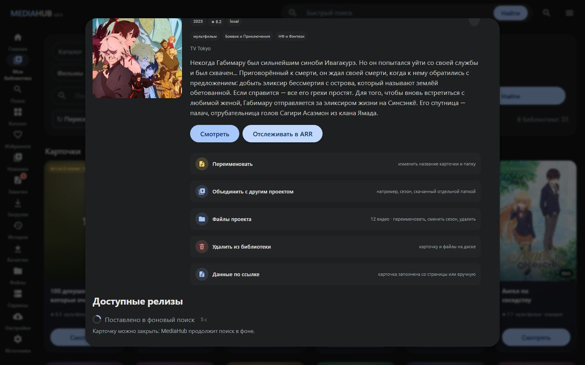

| Действие | Что делает |
|---|---|
| **Переименовать** | Меняет название карточки и папку на диске. |
| **Объединить с другим проектом** | Склеивает, например, сезон, скачанный отдельной папкой, с основным сериалом. |
| **Файлы проекта** | Список видео: переименовать файл, сменить сезон, удалить ненужное. |
| **Удалить из библиотеки** | Убирает карточку и её файлы с диска. |
| **Данные по ссылке** | Название, постер и описание со страницы или вручную. |
| **Отслеживать в ARR** | Передаёт тайтл в Radarr/Sonarr, чтобы новые серии качались сами. |

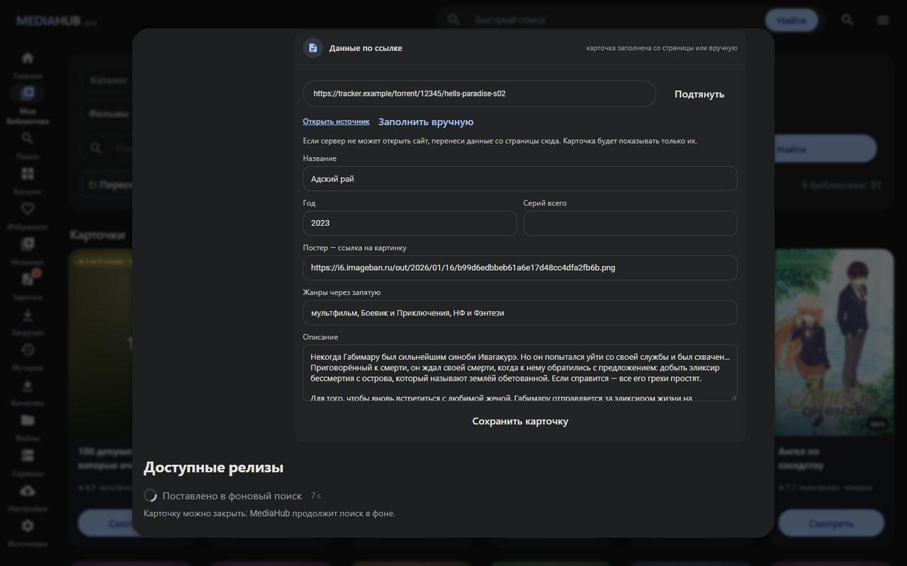

**Данные по ссылке → Подтянуть** берёт данные с указанной страницы. Если сервер не может её открыть, нажмите **Заполнить вручную** и перенесите название, год, число серий, ссылку на постер, жанры и описание. После **Сохранить карточку** везде показываются именно эти данные, в том числе на ТВ и телефоне.

## 7. Заметки и слежение за страницами

- **Заметки**: впишите название, например «Дюна, вторая часть». MediaHUB сам найдёт карточку и предложит скачать или отслеживать. Если не нашлось, нажмите «Найти снова» позже.
- **Слежение за страницами**: вставьте ссылку на страницу тайтла или на список новинок сайта.

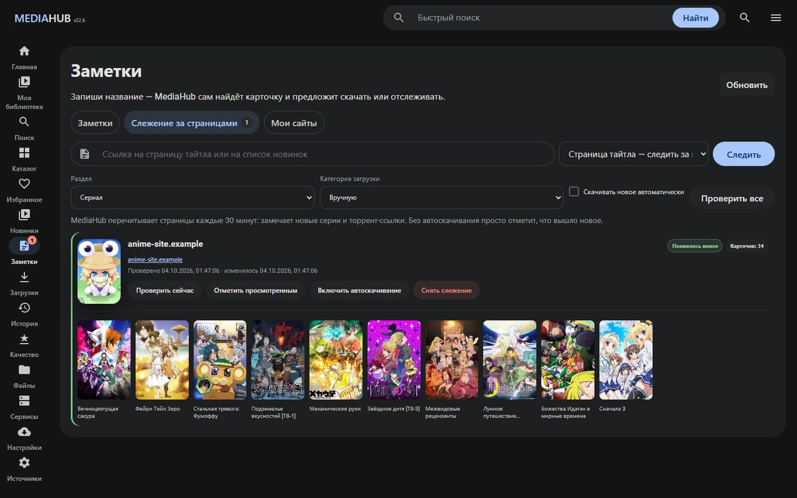

MediaHUB перечитывает такие страницы каждые 30 минут и отмечает новые серии и раздачи («Появилось новое»). С **автоскачиванием** новое сразу уходит в загрузку в выбранную категорию. Во вкладке **Мои сайты** хранятся закладки на любимые сайты.

## 8. Избранное и отслеживаемые

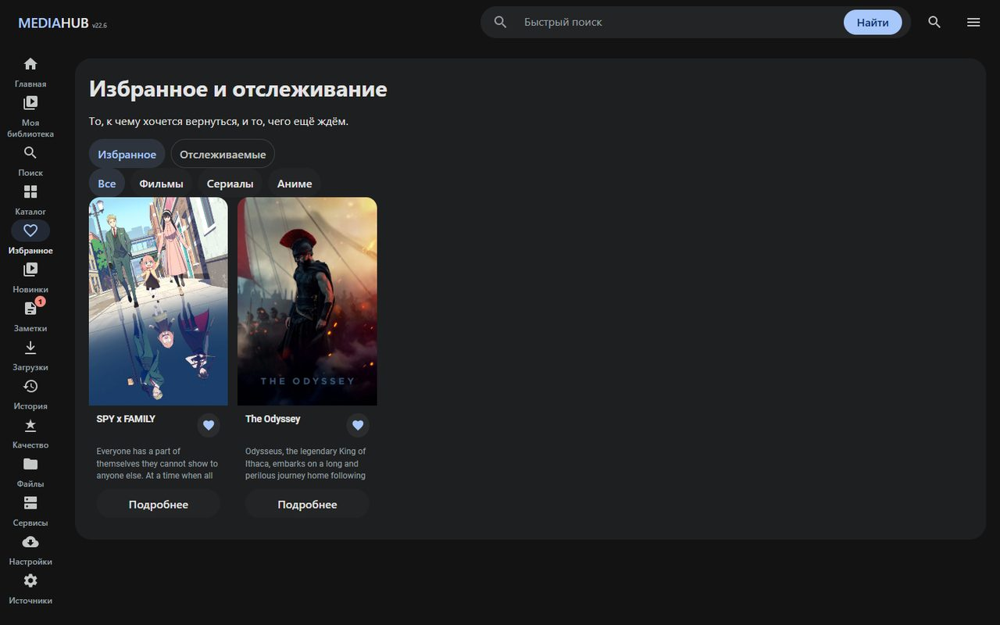

- **Избранное** — всё, что отмечено ♥, по разделам.
- **Отслеживаемые** — тайтлы, которые ещё не скачаны полностью, и число найденных для них релизов. Красный значок на пункте «Избранное» в меню означает, что для отслеживаемого появились раздачи.

## 9. Сервисы и стабильность

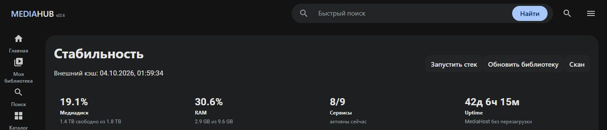

- Заполненность медиадиска, память, число работающих служб и время работы сервера.
- **Запустить стек**, **Обновить библиотеку**, **Скан** — в одно нажатие.
- Ниже — состояние каждого источника и службы (qBittorrent, Radarr, Sonarr, Prowlarr, таймеры MediaHUB) с журналом, перезапуском и причинами ошибок.

## 10. Настройки: приложения, ТВ и обновления

- **Скачать APK** — Android-приложение для телефона, планшета и Android TV, размещённое на вашем сервере.
- **Установить на телевизор** — введите IP телевизора, подтвердите «Разрешить отладку» на экране ТВ, и сервер сам поставит и запустит приложение. Подробности — в [APPS_RU.md](APPS_RU.md).
- **Обновления** — проверка новой версии на GitHub, новости версии и установка с резервной копией.
- **Подключения** — TMDB, прокси и ручные настройки сервисов; Radarr/Sonarr/Prowlarr/qBittorrent связываются автоматически.

## 11. Телевизор и телефон

На ТВ: главная с продолжением просмотра, страница тайтла с сериями, плеер с главами. Телефон работает как пульт: кнопка «На ТВ» запускает просмотр на телевизоре с той же секунды.

 &nbsp; 

